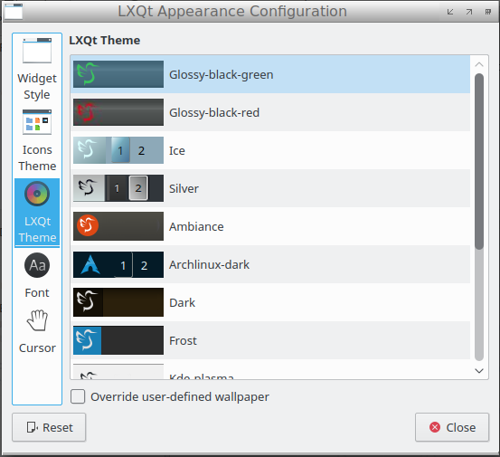

Themes for the LXQt Desktop
===============

* [Arch linux dark theme](https://github.com/stefonarch/archlinux-lxqt-theme)
* [Silver theme](https://github.com/stefonarch/silver-lxqt-theme)
* [Glossy black and red theme](https://github.com/stefonarch/black-red-lxqt-theme)
* [Glossy black and green theme](https://github.com/stefonarch/black-green-lxqt-theme)
* [Blue icy theme](https://github.com/stefonarch/ice-lxqt-theme)

Copy theme folders to /usr/share/lxqt/themes for system wide use or to ~/.local/share/lxqt/themes for single user'.
